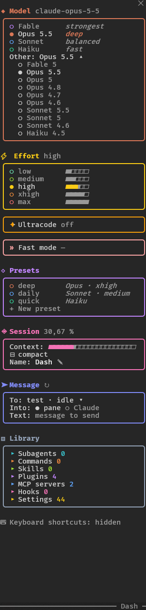
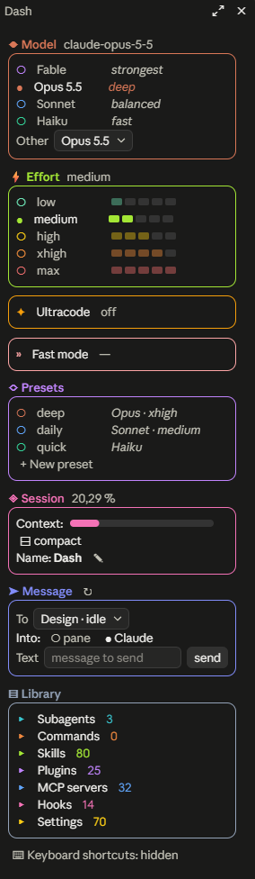

# dash — the session's dashboard

One pane, opened by `/dash`, that gathers what you would otherwise reach
through a dozen slash commands: the model, the effort level and presets
that set both, ultracode and fast mode, the context and quota gauges, the
cost and the duration, `/compact`, the session's name, your agents,
commands, skills, plugins, MCP servers and hooks, and the `/config`
settings. A click changes any of them. The model, the effort and the
session's gauges can also sit in the band above the prompt, and compact
mode folds each list onto its current row.

## Install

At the prompt of a Claude Code session in a terminal:

```
/plugin install dash --marketplace devohmycode/ccmods
```

Answer `y` to add the marketplace, then pick a scope.

<table>
  <tr>
    <th>Terminal</th>
    <th>Claude desktop (Code tab)</th>
  </tr>
  <tr>
    <td valign="top"></td>
    <td valign="top"></td>
  </tr>
</table>

Each model has its color: purple for Fable, orange for Opus, blue for
Sonnet, green for Haiku. The Model frame takes the active model's color,
and its row carries the version read from its id (`Opus 5.5`). Effort runs
from green to red, and its frame takes the active level's color. The
desktop app draws the effort gauges and the context bar as graphics, the
terminal as text.

A switch that goes through is announced by a 5 s toast:
`⇄ Model Opus → Sonnet`, `⚡ Effort medium → max` or
`◇ Preset deep: Sonnet → Opus, medium → xhigh`. When a switch fails, the
toast says why.

## Usage

| Command | Effect |
| --- | --- |
| `/dash` | opens the pane |
| `/dash opus`, `/dash sonnet`, `/dash haiku`, `/dash fable` | switches model without the pane |
| `/dash low` … `/dash max` | switches effort without the pane |
| `/dash deep`, `/dash quick`, … | applies a preset |
| `/dash ultracode`, `/dash ultracode off` | turns ultracode on or off (`/effort ultracode`) |
| `/dash set …` | lists or changes the mod's settings (see [Settings](#settings-dash-set)) |

## Model, effort and presets

- **Model**: the four current families, then **Other**, a drop-down of the
  versioned ids still served (Opus 4.8, Sonnet 4.6, Haiku 4.5…). No hook
  gives `/model`'s list, so the mod keeps its own (`MORE_MODELS`).
- **Effort**: `low` to `max`, each with its gauge. An effort just picked
  shows `(asked)` until a main request carries it.
- **Ultracode** and **Fast mode**: one button each (see
  [How it works](#how-it-works)).
- **Presets**: `deep` (Opus · xhigh), `daily` (Sonnet · medium) and `quick`
  (Haiku) out of the box. **+ New preset** opens a form — name, model,
  effort or the model's own — and **Add** saves it to the `presets`
  setting. A preset you added can be deleted from the pane; the shipped
  ones cannot.

## Session

- **Ctx**: how full the context window is, as the status line reads
  it, with its percentage next to the title.
- **5 h** and **Week**: the 5-hour and weekly quotas, how much of each rate-limit window
  is used, as a gauge and a percentage, and how long until it resets. A
  gateway's spend limit shows the same way.
  On an API key, with no subscription, the engine reports no window and
  these rows are left out.
- **Cost** and **Duration**: what the session has cost so far, as `/cost`
  totals it, and how long it has run. The pane redraws once a minute so
  the durations stay current.
- **Colors**: every gauge of the frame, the context's included, fills
  green under 50 %, yellow under 75 %, orange under 90 %, red after.
- **compact**: asks first, with an optional field for instructions, then
  runs `/compact <instructions>`. A stray click summarizes nothing.
- **Name**: renames the session through `/rename`. A `/rename` you type
  yourself shows here too.

## Band above the prompt

The **↧** next to the **Model**, **Effort** and **Session** titles puts
that frame's values in the band above the prompt, and takes them out
again; it is dim while they are not there, and a toast says which. The
band shows them in one row, wrapped where it is narrow:

- **Model**: the current model, in its color.
- **Effort**: the current level, in its color.
- **Session**: the context and quota gauges, the cost, the duration, and
  **compact**, which asks for a confirmation there too.

What the band shows is kept in the `band` setting, from one session to the
next; nothing put there, the band is left to Claude Code.

## Compact mode

**Compact mode** at the foot of the pane, above the shortcuts (or
`/dash set compact on`), folds the **Model**, **Effort** and **Presets**
frames onto their current row, or their first where none is current, and
hides **Other** and **+ New preset**. Pressed again, it unfolds them.

## Library

Seven folded sections, each with its count. A click on a title unfolds it
in a frame of its color.

| Section | What it lists | A click on an entry |
| --- | --- | --- |
| **Subagents** | your custom agents (the local `/context` breakdown) | puts `@agent-<name>` at the head of the prompt: your next message goes to it |
| **Commands** | the `.md` files under `commands/` (a subfolder is a namespace: `git/commit.md` → `/git:commit`) | puts `/<name>` at the head of the prompt |
| **Skills** | the folders under `skills/` that hold a `SKILL.md` | puts `/<name>` at the head of the prompt |
| **Plugins** | the plugins `enabledPlugins` names in your settings | turns it on or off (`claude plugin enable\|disable`); **↻ /reload-plugins** then applies it |
| **MCP servers** | the connected, configured and disabled servers | turns it on or off (`/mcp enable\|disable`) |
| **Hooks** | the hooks in your settings, by event, with how many run on each | nothing: `/hooks` changes them |
| **Settings** | every `/config` row | changes it at once: a switch, a drop-down or a field |

Subagents, commands and skills are split into two frames: **Global**
(`~/.claude/…`) then **Project** (the session folder's `.claude/…`). The
plugins' and the built-in ones are left out. Each frame shows its first 3
entries; **▾ Expand (+N)** shows the rest, **▴ Collapse** goes back. What is
unfolded stays so until the module reloads.

Putting a command or an agent in the prompt replaces one already there and
keeps what you typed after it. Nothing is sent until you send it. The filled
dot marks the entry the draft opens with. The lists are read again each time
`/dash` opens, so a file added during the session shows on the next open.
The global folder is `CLAUDE_CONFIG_DIR` where set, `~/.claude` otherwise.

## Keyboard shortcuts

Hidden by default. **Keyboard shortcuts: hidden** at the foot of the pane
(or `/dash set keyboard on`) shows them, each next to its row, and binds
them while the pane has focus.

The switches take one run of keys: digits for the models then the levels,
letters for the presets, then fast mode and ultracode. With the default
catalog: `1`–`4` model, `5`–`9` effort, `b` `d` `e` preset, `f` fast mode,
`i` ultracode. The run follows your settings.

The other buttons have a fixed key: `o` other models, `n` new preset, `v`
add it, `x` compact (`y` to confirm), `r` rename,
`a` `c` `s` `p` `m` `h` the library sections, `g` Settings, `l`
`/reload-plugins`, `k` hide the shortcuts.

## Settings (`/dash set`)

Installing the mod asks nothing: its settings are not in the manifest's
`userConfig`, every line of which Claude Code would show at install time.
They are set by command, and the mod keeps them in its own store, from one
session to the next.

| Command | Effect |
| --- | --- |
| `/dash set` | lists the settings and their values |
| `/dash set language fr` | changes a setting, in effect at once |
| `/dash set presets` | no value: back to the default |

| Setting | Default | Effect |
| --- | --- | --- |
| `language` | `en` | `en`, `fr`, `es`, `de`. A line a translation lacks shows in English. |
| `presets` | `deep=opus/xhigh, daily=sonnet/medium, quick=haiku` | `name=model/effort` or `name=model` (the effort stays as it is). |
| `models` | empty | ids to add after the built-in models: `id` or `id=Label` (`claude-opus-4-1=Opus 4.1`). |
| `hideModels` | empty | keys or ids to remove from the pane (`fable`). |
| `maxAgents` | empty | cap on agents per workflow (`3`); empty, none. |
| `keyboard` | `off` | `on` shows and binds the shortcuts. |
| `compact` | `off` | `on` folds the lists onto their current row. |
| `band` | empty | what the band above the prompt shows: `model`, `effort`, `session`, comma-separated. |

`models` and `hideModels` let you follow a model the built-in list does not
name yet: `/dash set hideModels fable` then
`/dash set models claude-fable-5-2=Fable 5.2` replace Fable's id without
touching the code. A preset named like a model, a level, `set` or
`ultracode` (`opus`, `max`) could never be reached by `/dash`, since that
name means something else first: it is refused. Any part of a setting that
does not read is set aside and named at the foot of the pane and in
`/dash set`'s answer, rather than failing the mod.

The description of `/dash` in the command list takes the new language at
the next session; the pane and the answers take it at once.

## How it works

- **A click runs Claude Code's own command**, `/model <alias>` or
  `/effort <level>`, as if you typed it. The session's setting changes and
  the status line follows; the mod does not stand between the session and
  its model.
- **A click also changes the default for new sessions**: `/effort` saves
  the level picked as the default setting.
- **A preset runs only what changes**: `/model` if the model differs, then
  `/effort` if the level differs and the model takes one. Both land before
  the next request, so the cache is lost only once.
- **Without `/effort`** (a version that lacks it), the mod keeps the level
  picked and writes it into each main request at `turn.step`, and the pane
  says so. If the engine then sends another level under the same model, the
  mod lets go of its own.
- **What the pane shows comes from the requests themselves.** Each main
  `turn.step` carries the model and effort the engine resolved, including
  after a silent downgrade: the pane shows what was sent, not what was
  asked. Before the first request, the model comes from `$.session.model()`
  and the effort from the `effortLevel` setting.
- **Picking the value already active runs nothing.** The toast says
  `already on …`, and the cache stays intact.
- **The active model is recognized by its id** first (a model added through
  `models`), then by its family. A model the pane does not offer shows by
  its id in the header, with no row checked.
- **A typed `/dash opus`** cannot run `/model` from its own hook: the
  session is waiting on that hook. The mod answers at once, then runs the
  command on a 0 ms timer. If the session is not ready yet, it says so
  rather than announcing a switch that will not happen.
- Haiku takes no effort: the levels are then drawn greyed out, no click or
  shortcut triggers them, and `/dash low` answers without running anything.
- **Fast mode** has a button only if the session knows `/fast`. It toggles;
  no hook reads its state, so the pane shows the one the last `/fast`
  reported (yours or its own), and `—` until one has run.
- **Ultracode** has a button only if the session knows `/effort`. It runs
  `/effort ultracode` or `/effort ultracode off` and leaves the effort level
  as it is. No hook reads its state: the pane shows the one the mod last
  asked for (off at session start, since it lasts one session). A
  `/effort ultracode` typed by hand escapes it. Its frame also shows the
  workflow size set in `/config`, read from `.claude.json` (read only: a
  mod does not write there).
- **Max agents**, a menu in the Ultracode frame (or `/dash set maxAgents
  3`): a hard cap on how many agents a workflow starts. A workflow's agents
  pass no hook (`agent.spawn` only sees the Agent tool), so the mod rewrites
  the script when the Workflow tool is called, a counter right after
  `meta`. Past the cap, `agent()` fails with `dash: agent cap (N) reached`,
  which `parallel()` and `pipeline()` turn into `null`. The cap fails
  closed: a script run by `scriptPath` is read and sent inline, capped; a
  workflow run by name, or a script with no `meta` literal, is refused with
  the reason; a nested `workflow()` is refused, its agents escaping the
  counter. Finding `meta` skips strings and comments. There is no token
  budget: a `+300k` typed in the message gave workflows no cap
  (`budget.total` empty, measured), so the mod adds none.
- Drop-down menus are missing on mobile, which does not draw them.

## Cost

Switching model or effort mid-session invalidates the message cache: the
next request writes the whole context again at full price. The pane does
not show it; the switch's toast says it, when it happens.

- **Tokens are measured**, not estimated: it is the usage the API reported
  for the last main request (input + cache reads and writes + output), the
  least the next request will send again.
- **The cache's state is inferred** from that request's age. No hook reads
  the cache TTL (5 min by default, 1 h on some accounts): in between, the
  toast counts the tokens the cache might still hold.
- A switch's toast adds `· 84 k tokens to cache again` when the cache could
  still hold them.
- "Full price" means a cache write: 1.25× the input price (5 min TTL) or 2×
  (1 h TTL), against 0.1× for a read. The toast counts tokens, not dollars.
- Only main requests count: a subagent has its own cache, which switching
  the session's model does not touch.

## Out of scope

`/effort auto` is not offered: `turn.step` reports the resolved level, so an
`auto` button could never show as active. A "session only" mode, which
would leave the default for new sessions alone, does not exist yet: for the
model, it would mean rewriting `e.model` at `turn.step`, and the status line
would no longer follow.
